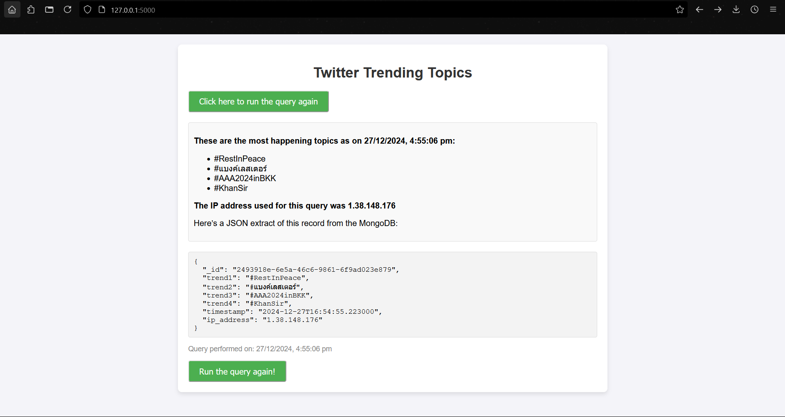

# Stir Tech Internship Task

## Project Description
This project is part of the Stir Tech Internship assignment. The task involves building a web scraping and data visualization system using Selenium, ProxyMesh, and MongoDB. The project allows users to fetch and display the top trending topics on Twitter.

## Screenshot



## Working video

<video controls src="AwesomeScreenshot-27_12_2024,4_53_35pm.mp4" title="Title"></video>

## Features
- **Web Scraping with Selenium**: Automates fetching trending topics from Twitter.
- **Proxy Usage**: Ensures each request is sent through a different IP using ProxyMesh.
- **MongoDB Integration**: Stores scraped data with a unique ID, timestamp, and IP address.
- **HTML Interface**: Provides a simple user interface for triggering the script and displaying results.

## Prerequisites
Ensure you have the following installed:
- Python 3.7+
- MongoDB (local or cloud-based, e.g., MongoDB Atlas)
- Required Python libraries (specified in `requirements.txt`)
- Selenium WebDriver (e.g., geckodriver for Firefox)
- firefox web browser

## Installation
1. **Clone the repository:**
   ```bash
   git clone <repository_url>
   cd <repository_folder>
   ```

2. **Set up a virtual environment:**
   - Windows:
     ```bash
     python -m venv venv
     .\venv\Scripts\activate
     ```
   - macOS/Linux:
     ```bash
     python3 -m venv venv
     source venv/bin/activate
     ```

3. **Install dependencies:**
   ```bash
   pip install -r requirements.txt
   ```

4. **Configure environment variables:**
   - Create a `.env` file in the root directory.
   - Add the following variables:
     ```env
     X_USERNAME=<Your Twitter Username>
     X_PASSWORD=<Your Twitter Password>
     DATABASE_URL=<Your MongoDB Connection String>
     PROXYMESH_URL=<Your ProxyMesh URL>
     ```

5. **Set up MongoDB:**
   - Ensure MongoDB is running locally or accessible via the provided `DATABASE_URL`.

## Usage
1. **Run the Flask application:**
   ```bash
   python run.py
   ```
3. **Fetch trending topics:**
   - Click the "Run Script" button on the HTML page.
   - View the results directly on the page, including the trends, timestamp, IP address, and JSON extract.

## Expected Output
- **HTML Page**:
  - "Click here to run the script."
  - After execution:
    ```
    These are the most happening topics as on {Date and Time of end of Selenium Script}
    - Name of trend1
    - Name of trend2
    - Name of trend3
    - Name of trend4
    - Name of trend5

    The IP address used for this query was XXX.XXX.XXX.XXX.

    Here’s a JSON extract of this record from the MongoDB:
    [
        {
            "_id": "...",
            "nameoftrend1": "...",
            "nameoftrend2": "...",
            ...
        }
    ]

    Click here to run the query again.
    ```


## Files Included
- **`selenium_script.py`**: Contains the Selenium-based web scraping script.
- **`run.py`**: Entry point for running the Flask application.
- **`templates/index.html`**: HTML template for the interface.
- **`requirements.txt`**: Python dependencies.


## Acknowledgments
- **Stir Team**: For the opportunity to complete this task.
- **Python Selenium Documentation**: For detailed guidance on Selenium usage.

